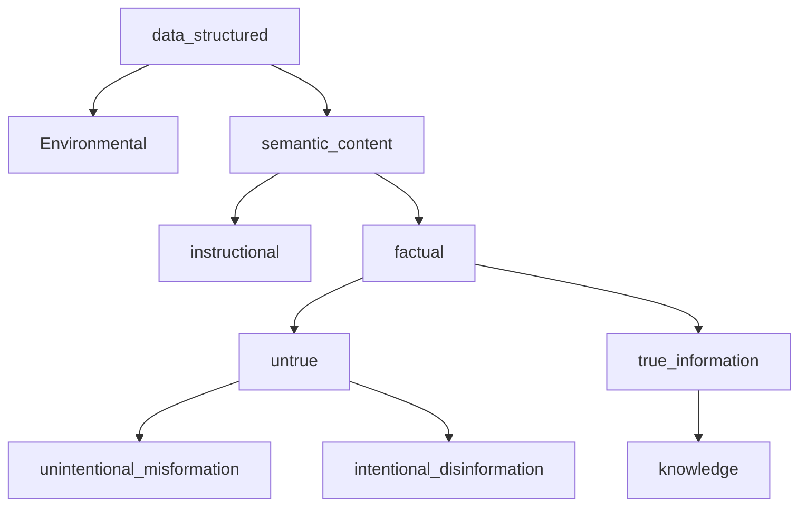

# Notes from Information by Luciano Floridi

- Semantic information can be instructional or factual
- Factual information can be untrue (misinformation or disinformation) or true (information - > knowledge)

> p qualifies as factual semantic information iff p is well-formed, meaningful and veridical data

## Knowledge and information

- Knowledge encapsulates truth beacuse it encapsualtes semantic knowledge, which in turn incapsulates truth
- Knowledge and information are members of same conceptual family
  - The difference is knoweldge is a web of mutual relations that allow one part to it to account for another.
      
